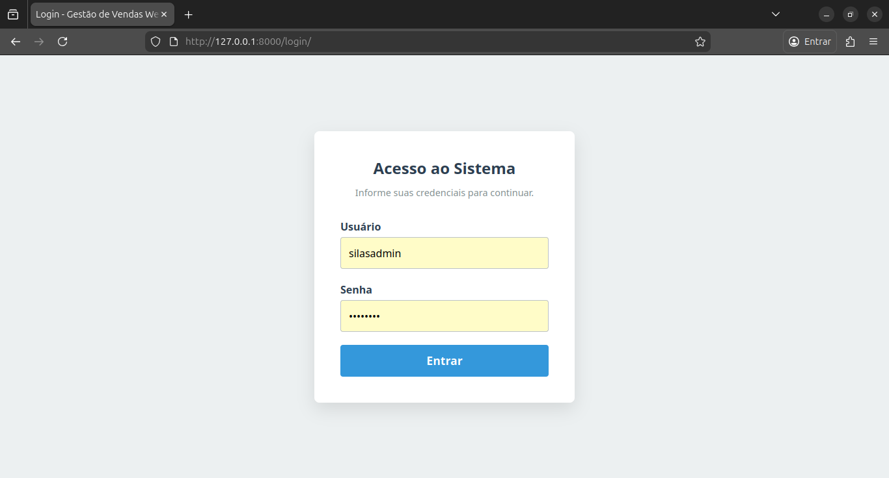
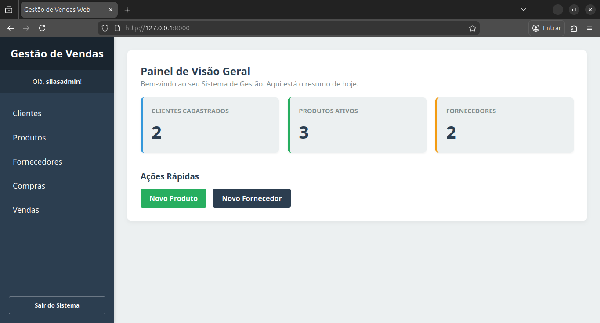
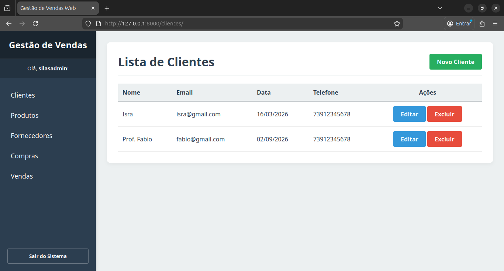
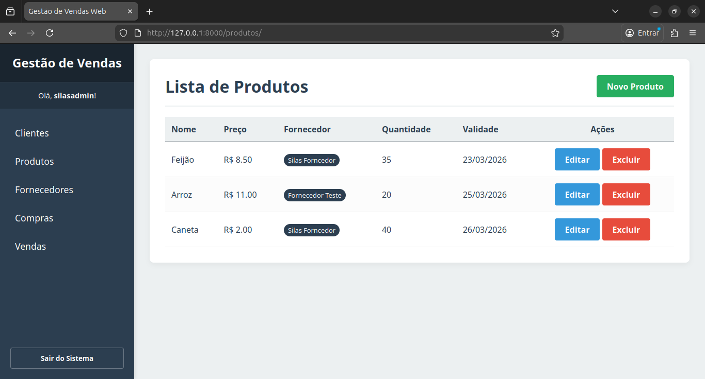
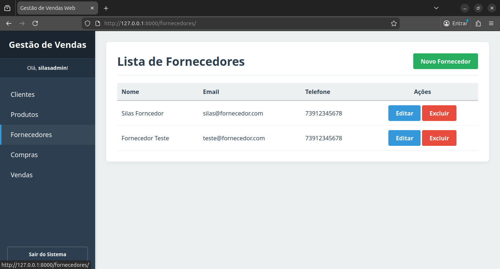
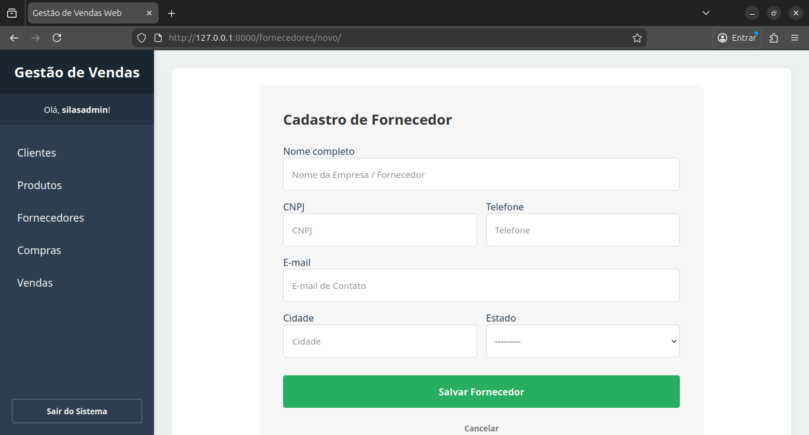
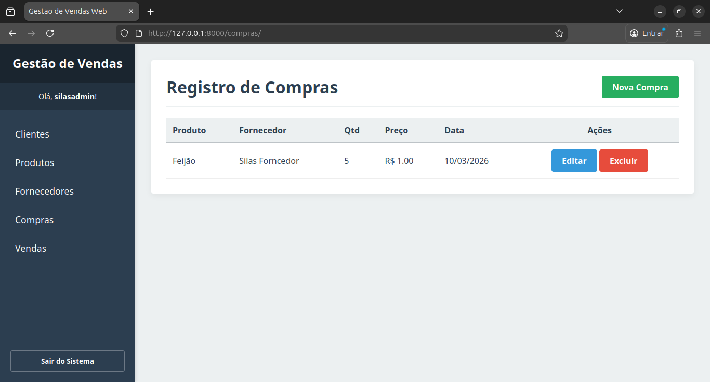
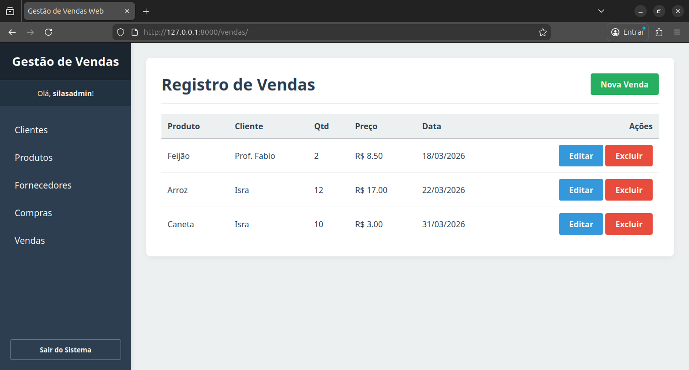
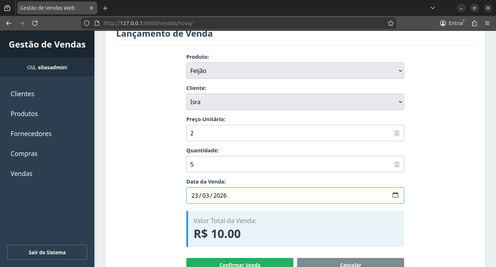

# 📊 ERP Vendas - Sistema de Gestão Profissional


Um Sistema de Gestão (ERP) completo desenvolvido em Python com o framework Django. O sistema possui controle de estoque automatizado, autenticação de usuários, painel de indicadores (Dashboard) e interfaces modernas.

---

## 📸 Telas do Sistema


| Login | Dashboard | Clientes |
| :---: | :---: | :---: |
|  |  |  |

| Produtos | Fornecedores | Criar Fornecedores |
| :---: | :---: | :---: |
|  |  |  |

| Compras | Vendas | Criar Venda |
| :---: | :---: | :---: |
|  |  |  |

---

## 🚀 Principais Funcionalidades

Este projeto vai muito além de um CRUD simples, implementando regras de negócio e interações avançadas:

* 🔒 **Autenticação e Segurança:** Sistema de Login/Logout protegendo todas as rotas da aplicação (`LoginRequiredMixin`).
* 📈 **Dashboard Dinâmico:** Painel inicial com indicadores reais alimentados pelo banco de dados.
* 📦 **Controle Automático de Estoque (Triggers no Backend):**
    * **Compras:** Adicionam saldo ao estoque do produto. Edições e estornos (exclusões) recalcula o saldo automaticamente.
    * **Vendas:** Subtraem saldo do estoque. Estornos devolvem o produto à prateleira.
* 🛡️ **Validação de Negócio:** Bloqueio de vendas caso a quantidade solicitada seja maior que o estoque disponível.
* 🔗 **Master-Detail (Formsets):** Cadastro de produtos (Detalhe) aninhado diretamente dentro do cadastro de Fornecedores (Mestre) em uma única tela.
* ⚡ **Dropdown Encadeado (AJAX):** Na tela de Compras, ao selecionar um Fornecedor, a lista de Produtos é filtrada em tempo real via JavaScript consumindo uma API RESTful interna.
* 🧮 **Cálculos em Tempo Real:** O valor total da venda é calculado dinamicamente no Front-End via JavaScript antes do envio do formulário.

---

## 🛠️ Tecnologias Utilizadas

### Back-End
* **[Python](https://www.python.org/):** Linguagem principal.
* **[Django](https://www.djangoproject.com/):** Framework web (MVT - Model, View, Template).
* **Class-Based Views (CBVs):** Para um código mais limpo, reutilizável e profissional.
* **SQLite3:** Banco de dados relacional padrão.

### Front-End
* **HTML5 & CSS3 (Vanilla):** Layout responsivo construído do zero com CSS Grid e Flexbox, sem dependência de frameworks como Bootstrap.
* **JavaScript (ES6):** Utilizado para requisições assíncronas (Fetch API) e manipulação do DOM.

---

## ⚙️ Como Executar o Projeto Localmente

Siga os passos abaixo para rodar o projeto na sua máquina:

**1. Clone o repositório ou baixe o código fonte:**
```bash
git clone [https://github.com/SilasCorreia8/sistema-de-gestao](https://github.com/SilasCorreia8/sistema-de-gestao)
cd sistema-de-gestao
```

**2. Crie um Ambiente Virtual:**
```bash
# Windows
python -m venv venv
venv\Scripts\activate

# Linux/Mac
python3 -m venv venv
source venv/bin/activate
```

**3. Instale as dependências:**
```bash
pip install django
```

**4. Realize as Migrações do Banco de Dados:**
```bash
python manage.py makemigrations
python manage.py migrate
```

**5. Crie um Superusuário para acessar o sistema:**
```bash
python manage.py createsuperuser
```

**6. Inicie o servidor local:**
```bash
python manage.py runserver
Abra http://127.0.0.1:8000/ e faça o login com o superusuário criado.
```